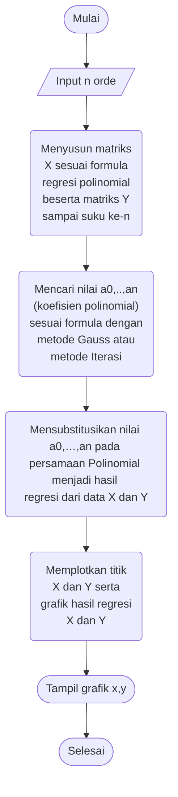

# KN-M6

<a href="https://github.com/yozoracaelum/KN-M6/files/11332168/Materi.pdf" target="_blank">Materi.pdf</a>

## Regresi

```mermaid
graph TD;
    A([Mulai])-->B[/Input n orde/];
    B-->C("Menyusun matriks<br> X sesuai formula <br>regresi polinomial <br>beserta matriks Y <br>sampai suku ke-n");
    C-->D("Mencari nilai a0,..,an <br>(koefisien polinomial) <br>sesuai formula dengan <br>metode Gauss atau <br>metode Iterasi");
    D-->E("Mensubstitusikan nilai a0,…,an pada <br>persamaan Polinomial menjadi hasil <br>regresi dari data X dan Y");
    E-->F(Memplotkan titik <br>X dan Y serta <br>grafik hasil regresi <br>X dan Y);
    F-->G([Tampil grafik x,y]);
    G-->H([Selesai]);
```
